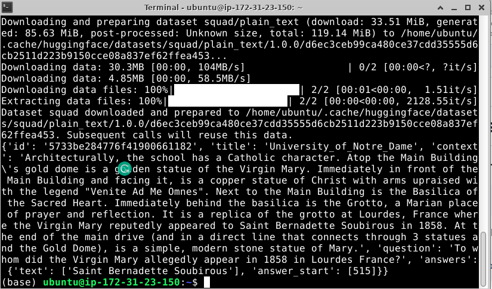

#  Install Hugging Face datasets

### Step 1) Install datasets, you may find them useful

```bash
pip install datasets
```

* Run the following command to check if 🤗 Datasets has been properly installed:

```bash
python -c "from datasets import load_dataset; print(load_dataset('squad', split='train')[0])"
```

* You should see something like this



### Step 2) For the upcoming labs

```bash
pip install sentencepiece
```


