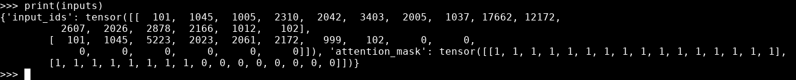
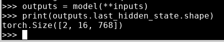

# Pipeline explained

* In this lab we will go behind the Pipeline and see how it works

#### Lab Goals:

* Go deeper into the Pipeline
* Investigate what is going on behind the scenes


### Step 1: Repeat sentiment analysis

```python
from transformers import pipeline

classifier = pipeline("sentiment-analysis")
classifier(
    [
        "I've been waiting for a HuggingFace course my whole life.",
        "I hate this so much!",
    ]
)
```

* Obtain this

```text
[{'label': 'POSITIVE', 'score': 0.9598047137260437},
 {'label': 'NEGATIVE', 'score': 0.9994558095932007}]
```

### Step 2: Investigate the tokenizer

```python
from transformers import AutoTokenizer
checkpoint = "distilbert-base-uncased-finetuned-sst-2-english"
tokenizer = AutoTokenizer.from_pretrained(checkpoint)
```

* Specify the type of tensors we want to get back

```python
raw_inputs = [
    "I've been waiting for a HuggingFace course my whole life.",
    "I hate this so much!",
]
inputs = tokenizer(raw_inputs, padding=True, truncation=True, return_tensors="pt")
print(inputs)
```


* Here is your tensor




### Step 3: Investigate the model

```python
from transformers import AutoModel

checkpoint = "distilbert-base-uncased-finetuned-sst-2-english"
model = AutoModel.from_pretrained(checkpoint)
```

* Let's dump the output of the model

```python
outputs = model(**inputs)
print(outputs.last_hidden_state.shape)
``` 

* Here is your output



