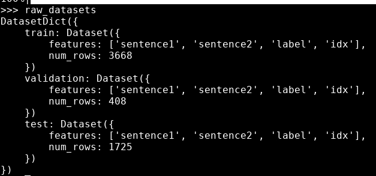
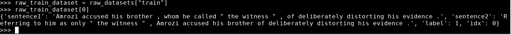
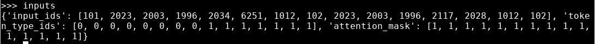
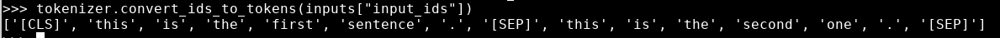

# Processing the data

* In this lab we will prepare the data for fine-tuning the model

## Depends on

[Pipeline lab](../06-Pipeline/README.md)

#### Lab Goals:

* Prepare the data for fine-tuning

### Step 1: Create an account on HuggingFace

* See above

### Step 2: Process the data as before

```python
import torch
from transformers import AdamW, AutoTokenizer, AutoModelForSequenceClassification

# Same as before
checkpoint = "bert-base-uncased"
tokenizer = AutoTokenizer.from_pretrained(checkpoint)
model = AutoModelForSequenceClassification.from_pretrained(checkpoint)
sequences = [
    "I've been waiting for a HuggingFace course my whole life.",
    "This course is amazing!",
]
batch = tokenizer(sequences, padding=True, truncation=True, return_tensors="pt")

# This is new
batch["labels"] = torch.tensor([1, 1])

optimizer = AdamW(model.parameters())
loss = model(**batch).loss
loss.backward()
optimizer.step()
```

### Step 3: Load a dataset from HuggingFace

```python
from datasets import load_dataset

raw_datasets = load_dataset("glue", "mrpc")
raw_datasets
```

* You should see something like this:




### Step 4: Look at one phrase in the dataset

```python
raw_train_dataset = raw_datasets["train"]
raw_train_dataset[0]
```

* Your output
* (I recommend making your window wide enough to see the whole output)



### Step 5: Display data labels

* To know which integer corresponds to which label, we can inspect the features of our raw_train_dataset. This will tell us the type of each column:

```python
raw_train_dataset.features
```

* Your output

```text
{'sentence1': Value(dtype='string', id=None),
 'sentence2': Value(dtype='string', id=None),
 'label': ClassLabel(num_classes=2, names=['not_equivalent', 'equivalent'], names_file=None, id=None),
 'idx': Value(dtype='int32', id=None)}  
```

### Step 6: Check your understanding

* Behind the scenes, label is of type ClassLabel, and the mapping of integers to label name is stored in the names folder. 0 corresponds to not_equivalent, and 1 corresponds to equivalent.

### Quiz for Step 6
* Look at element 15 of the training set and element 87 of the validation set. What are their labels?

### Step 7: Preprocess the dataset
* To preprocess the dataset, we need to convert the text to numbers the model can make sense of. As you saw in the previous chapter, this is done with a tokenizer. We can feed the tokenizer one sentence or a list of sentences, so we can directly tokenize all the first sentences and all the second sentences of each pair like this:

```python
from transformers import AutoTokenizer

checkpoint = "bert-base-uncased"
tokenizer = AutoTokenizer.from_pretrained(checkpoint)
tokenized_sentences_1 = tokenizer(raw_datasets["train"]["sentence1"])
tokenized_sentences_2 = tokenizer(raw_datasets["train"]["sentence2"])
```

* However, **do not do this!** Why?
* We can’t just pass two sequences to the model and get a prediction of whether the two sentences are paraphrases or not. We need to handle the two sequences as a pair, and apply the appropriate preprocessing. Fortunately, the tokenizer can also take a pair of sequences and prepare it the way our BERT model expects:
* Here is what we need to do:

```python
inputs = tokenizer("This is the first sentence.", "This is the second one.")
inputs
```
* Here is the result



* Decode the IDs inside input_ids back to words:

```python
tokenizer.convert_ids_to_tokens(inputs["input_ids"])
```

* Get the following



* Now the input and the Token type ID agree
````text
['[CLS]', 'this', 'is', 'the', 'first', 'sentence', '.', '[SEP]', 'this', 'is', 'the', 'second', 'one', '.', '[SEP]']
[      0,      0,    0,     0,       0,          0,   0,       0,      1,    1,     1,        1,     1,   1,       1]
````


### Step 8: Preprocess the training dataset

```python
tokenized_dataset = tokenizer(
    raw_datasets["train"]["sentence1"],
    raw_datasets["train"]["sentence2"],
    padding=True,
    truncation=True,
)
```

* However, we need the complete dataset in memory
* Instead, let us create a function

```python
def tokenize_function(example):
    return tokenizer(example["sentence1"], example["sentence2"], truncation=True)
```

* Apply the tokenization function on all our datasets at once. We’re using batched=True in our call to map so the function is applied to multiple elements of our dataset at once, and not on each element separately. This allows for faster preprocessing.
* And it will fit in memory because it works in a distributed fashion.

```python
tokenized_datasets = raw_datasets.map(tokenize_function, batched=True)
tokenized_datasets
```


