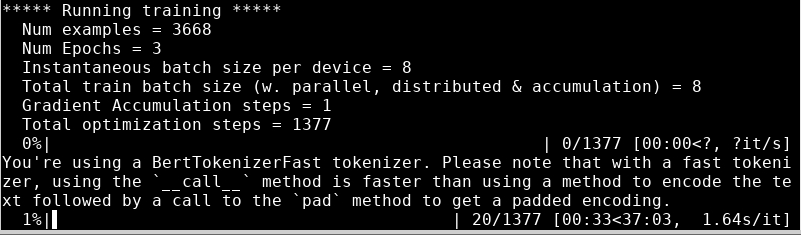
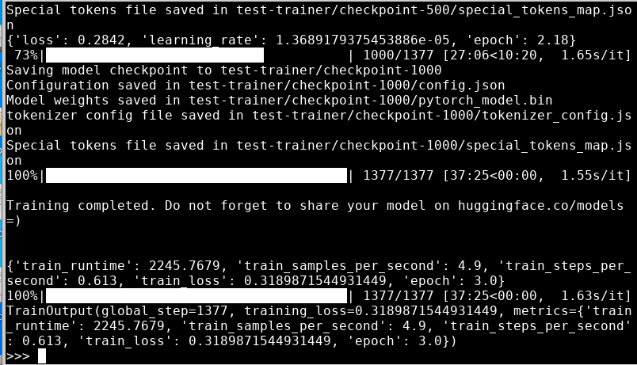
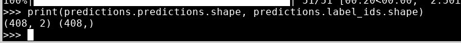
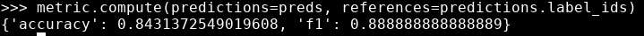

# Fine-Tuning

* In this lab we will fine-tune a pre-trained model.

#### Lab Goals:

* TODO
### Step 0:

`pip install evaluate`

* if you have not done so already

### Step 1: Summary of the steps done before

* This will be especially useful if you are switching to Google Colab.
* 
```python
from datasets import load_dataset
from transformers import AutoTokenizer, DataCollatorWithPadding

raw_datasets = load_dataset("glue", "mrpc")
checkpoint = "bert-base-uncased"
tokenizer = AutoTokenizer.from_pretrained(checkpoint)


def tokenize_function(example):
    return tokenizer(example["sentence1"], example["sentence2"], truncation=True)


tokenized_datasets = raw_datasets.map(tokenize_function, batched=True)
data_collator = DataCollatorWithPadding(tokenizer=tokenizer)
```

### Step 2: Define the training set

```python
from transformers import TrainingArguments
training_args = TrainingArguments("test-trainer")
```

### Step 3: Create a model

```python
from transformers import AutoModelForSequenceClassification

model = AutoModelForSequenceClassification.from_pretrained(checkpoint, num_labels=2)
```

### Step 4: Create a trainer
    
```python   
from transformers import Trainer

trainer = Trainer(
model,
training_args,
train_dataset=tokenized_datasets["train"],
eval_dataset=tokenized_datasets["validation"],
data_collator=data_collator,
tokenizer=tokenizer,
)
```

### Step 5: Train!

```python
trainer.train()
```

* Here is the statistics on my VM (c5.xlarge):



* It actually completed while I was doing other things



### Step 6: Evaluate

```python
predictions = trainer.predict(tokenized_datasets["validation"])
print(predictions.predictions.shape, predictions.label_ids.shape)
```

* You should see something like this:



### Step 7: Prepare predictions

```python
import numpy as np
preds = np.argmax(predictions.predictions, axis=-1)

```

### Step 8: Compute metrics

```python
import evaluate

metric = evaluate.load("glue", "mrpc")
metric.compute(predictions=preds, references=predictions.label_ids)
```

* You should see something like this:


### Step 9: Define `compute_metrics`

```python
def compute_metrics(eval_preds):
    metric = evaluate.load("glue", "mrpc")
    logits, labels = eval_preds
    predictions = np.argmax(logits, axis=-1)
    return metric.compute(predictions=predictions, references=labels)
```

### Step 10: Train again

```python
training_args = TrainingArguments("test-trainer", evaluation_strategy="epoch")
model = AutoModelForSequenceClassification.from_pretrained(checkpoint, num_labels=2)

trainer = Trainer(
    model,
    training_args,
    train_dataset=tokenized_datasets["train"],
    eval_dataset=tokenized_datasets["validation"],
    data_collator=data_collator,
    tokenizer=tokenizer,
    compute_metrics=compute_metrics,
)
```

* An now...

```python
trainer.train()
```

* This time, it will report the validation loss and metrics at the end of each epoch on top of the training loss. Again, the exact accuracy/F1 score you reach might be a bit different from what we found, because of the random head initialization of the model, but it should be in the same ballpark.