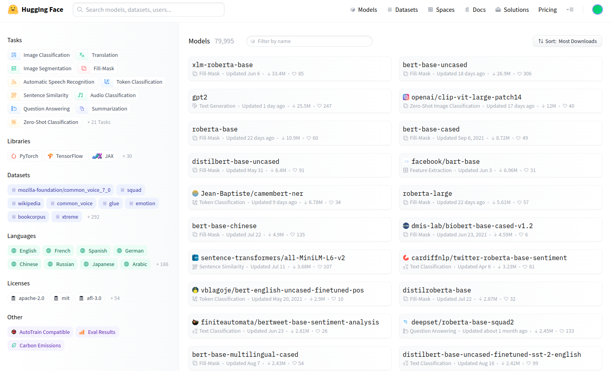
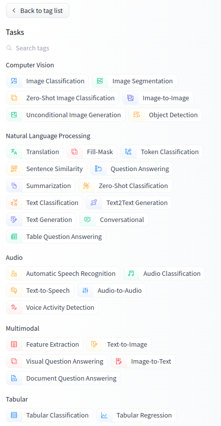
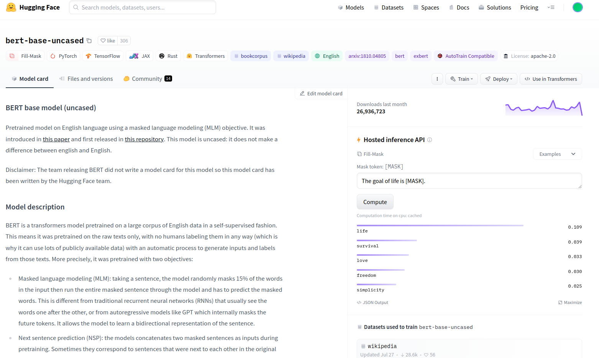

# Navigating HuggingFace Hub

* Navigate to the [HuggingFace Hub](https://huggingface.co/) and create an account.

* Click on "Models" in the top menu. 
* On the left, you see the tags that can be broken into 
    * Tasks
    * Libraries
    * Datasets
    * Languages
    * Licenses
    * Other

* Let's look at the "Tasks". Investigate all tasks that are available.

* Look at the languages. Select the language of your choice. Then clear the languages tag. How many models did you get in your favorite language?

* Now let us look at a specific model, for example, the [BERT base model uncased](https://huggingface.co/bert-base-uncased?text=The+goal+of+life+is+%5BMASK%5D.)  

* This is called **The model card**. It contains information about the model, such as the model architecture, the training data, the evaluation data, and the results. It also contains the code to load the model and the tokenizer.

