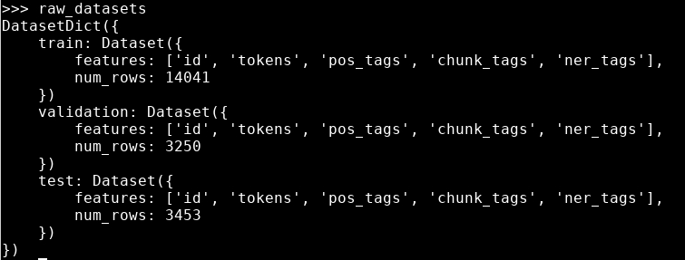

# Token classification

In this lab we will practice token classification with Transformers and HuggingFace


Lab Goals:

* Classify tokens in a sentence

### STEP 1) Prepare the data

* To load the CoNLL-2003 dataset, we use the load_dataset() method from the 🤗 Datasets library:

```python
from datasets import load_dataset
raw_datasets = load_dataset("conll2003")
```

* You will see the following output:


* Note that the data will be reused
* Verify that the data is reused:

```python
raw_datasets = load_dataset("conll2003")
```

* Look at the data

```python
raw_datasets
```



* Let’s have a look at the first element of the training set:
```python
raw_datasets["train"][0]["tokens"]
```

```text
['EU', 'rejects', 'German', 'call', 'to', 'boycott', 'British', 'lamb', '.']
```

* Since we want to perform named entity recognition, we will look at the NER tags:

```python
raw_datasets["train"][0]["ner_tags"]
```

```text
[3, 0, 7, 0, 0, 0, 7, 0, 0]
```

* Those are the labels as integers ready for training, but they’re not necessarily useful when we want to inspect the data. Like for text classification, we can access the correspondence between those integers and the label names by looking at the features attribute of our dataset:

```python
ner_feature = raw_datasets["train"].features["ner_tags"]
ner_feature
```

```text
Sequence(feature=ClassLabel(num_classes=9, names=['O', 'B-PER', 'I-PER', 'B-ORG', 'I-ORG', 'B-LOC', 'I-LOC', 'B-MISC', 'I-MISC'], names_file=None, id=None), length=-1, id=None)
```

* Let us look at label names:

```python
label_names = ner_feature.feature.names
label_names
```

```text
['O', 'B-PER', 'I-PER', 'B-ORG', 'I-ORG', 'B-LOC', 'I-LOC', 'B-MISC', 'I-MISC']
```

* What are these?
```text
O means the word doesn’t correspond to any entity.
B-PER/I-PER means the word corresponds to the beginning of/is inside a person entity.
B-ORG/I-ORG means the word corresponds to the beginning of/is inside an organization entity.
B-LOC/I-LOC means the word corresponds to the beginning of/is inside a location entity.
B-MISC/I-MISC means the word corresponds to the beginning of/is inside a miscellaneous entity.
```

* Let us decode those labels:

```python
words = raw_datasets["train"][0]["tokens"]
labels = raw_datasets["train"][0]["ner_tags"]
line1 = ""
line2 = ""
for word, label in zip(words, labels):
    full_label = label_names[label]
    max_length = max(len(word), len(full_label))
    line1 += word + " " * (max_length - len(word) + 1)
    line2 += full_label + " " * (max_length - len(full_label) + 1)

print(line1)
print(line2)
```

```text
'EU    rejects German call to boycott British lamb .'
'B-ORG O       B-MISC O    O  O       B-MISC  O    O'
```

* Bonus
* Print the same two sentences with their POS or chunking labels.

### STEP 2) Create the tokenizer object

```python
from transformers import AutoTokenizer

model_checkpoint = "bert-base-cased"
tokenizer = AutoTokenizer.from_pretrained(model_checkpoint)
```

* Verify that we have a `fast` tokenizer

```python
tokenizer.is_fast
```

```text
True
```

* To tokenize the pre-tokenized input

```python
inputs = tokenizer(raw_datasets["train"][0]["tokens"], is_split_into_words=True)
inputs.tokens()
```

```text
['[CLS]', 'EU', 'rejects', 'German', 'call', 'to', 'boycott', 'British', 'la', '##mb', '.', '[SEP]']
```

* Map each token to its corresponding word

```python
inputs.word_ids()
```

```text
[None, 0, 1, 2, 3, 4, 5, 6, 7, 7, 8, None]
```

* With a tiny bit of work, we can then expand our label list to match the tokens. The first rule we’ll apply is that special tokens get a label of -100. This is because by default -100 is an index that is ignored in the loss function we will use (cross entropy). Then, each token gets the same label as the token that started the word it’s inside, since they are part of the same entity. For tokens inside a word but not at the beginning, we replace the B- with I- (since the token does not begin the entity):

```python
def align_labels_with_tokens(labels, word_ids):
    new_labels = []
    current_word = None
    for word_id in word_ids:
        if word_id != current_word:
            # Start of a new word!
            current_word = word_id
            label = -100 if word_id is None else labels[word_id]
            new_labels.append(label)
        elif word_id is None:
            # Special token
            new_labels.append(-100)
        else:
            # Same word as previous token
            label = labels[word_id]
            # If the label is B-XXX we change it to I-XXX
            if label % 2 == 1:
                label += 1
            new_labels.append(label)
    return new_labels
```

* Let’s try it out on our first sentence:

```python
labels = raw_datasets["train"][0]["ner_tags"]
word_ids = inputs.word_ids()
print(labels)
print(align_labels_with_tokens(labels, word_ids))
```

```text
[3, 0, 7, 0, 0, 0, 7, 0, 0]
[-100, 3, 0, 7, 0, 0, 0, 7, 0, 0, 0, -100]
```

* As we can see, our function added the -100 for the two special tokens at the beginning and the end, and a new 0 for our word that was split into two tokens.

* Bonus
* Some researchers prefer to attribute only one label per word, and assign -100 to the other subtokens in a given word. This is to avoid long words that split into lots of subtokens contributing heavily to the loss. Change the previous function to align labels with input IDs by following this rule.

### STEP 3) Preprocess the dataset

* To preprocess our whole dataset, we need to tokenize all the inputs and apply align_labels_with_tokens() on all the labels. To take advantage of the speed of our fast tokenizer, it’s best to tokenize lots of texts at the same time, so we’ll write a function that processes a list of examples and use the Dataset.map() method with the option batched=True. The only thing that is different from our previous example is that the word_ids() function needs to get the index of the example we want the word IDs of when the inputs to the tokenizer are lists of texts (or in our case, list of lists of words), so we add that too:

```python
def tokenize_and_align_labels(examples):
    tokenized_inputs = tokenizer(
        examples["tokens"], truncation=True, is_split_into_words=True
    )
    all_labels = examples["ner_tags"]
    new_labels = []
    for i, labels in enumerate(all_labels):
        word_ids = tokenized_inputs.word_ids(i)
        new_labels.append(align_labels_with_tokens(labels, word_ids))
    tokenized_inputs["labels"] = new_labels
    return tokenized_inputs
```

```python
tokenized_datasets = raw_datasets.map(
    tokenize_and_align_labels,
    batched=True,
    remove_columns=raw_datasets["train"].column_names,
)  
```


* Let’s check the result on our first example:

```python
tokenized_datasets
```


### STEP 4) Fine-tuning the model with the Trainer API

* Collate the tokenized datasets into a single one. Use a HuggingFace function `DataCollatorForTokenClassification`. 

```python
from transformers import DataCollatorForTokenClassification
data_collator = DataCollatorForTokenClassification(tokenizer=tokenizer)
```

* To test this on a few samples, we can just call it on a list of examples from our tokenized training set:
```python
batch = data_collator([tokenized_datasets["train"][i] for i in range(2)])
batch["labels"]
```

```text
tensor([[-100,    3,    0,    7,    0,    0,    0,    7,    0,    0,    0, -100],
        [-100,    1,    2, -100, -100, -100, -100, -100, -100, -100, -100, -100]])  
``` 

* Let’s compare this to the labels for the first and second elements in our dataset:

```python
for i in range(2):
    print(tokenized_datasets["train"][i]["labels"])
```

```text
[-100, 3, 0, 7, 0, 0, 0, 7, 0, 0, 0, -100]
[-100, 1, 2, -100]
```

* To have the Trainer compute a metric every epoch, we will need to define a compute_metrics() function that takes the arrays of predictions and labels, and returns a dictionary with the metric names and values.

* The traditional framework used to evaluate token classification prediction is seqeval. To use this metric, we first need to install the seqeval library:
* (To save yourself the trouble, you can run it in a separate terminal window)


* We can then load it via the evaluate.load() function

```python
import evaluate
metric = evaluate.load("seqeval")
```


* Get the labels for our first training example:

```python
labels = raw_datasets["train"][0]["ner_tags"]
labels = [label_names[i] for i in labels]
labels
```

```text
['B-ORG', 'O', 'B-MISC', 'O', 'O', 'O', 'B-MISC', 'O', 'O']
``` 

* We can then create fake predictions for those by just changing the value at index 2:
```python
predictions = labels.copy()
predictions[2] = "O"
metric.compute(predictions=[predictions], references=[labels])
```


* Note that the metric takes a list of predictions (not just one) and a list of labels. Here’s the output:

```text
{'MISC': {'precision': 1.0, 'recall': 0.5, 'f1': 0.67, 'number': 2},
 'ORG': {'precision': 1.0, 'recall': 1.0, 'f1': 1.0, 'number': 1},
 'overall_precision': 1.0,
 'overall_recall': 0.67,
 'overall_f1': 0.8,
 'overall_accuracy': 0.89}
```

* That is a lot of information but we need just a little
* Here is a function to massage the output into a single number:

```python
import numpy as np


def compute_metrics(eval_preds):
    logits, labels = eval_preds
    predictions = np.argmax(logits, axis=-1)

    # Remove ignored index (special tokens) and convert to labels
    true_labels = [[label_names[l] for l in label if l != -100] for label in labels]
    true_predictions = [
        [label_names[p] for (p, l) in zip(prediction, label) if l != -100]
        for prediction, label in zip(predictions, labels)
    ]
    all_metrics = metric.compute(predictions=true_predictions, references=true_labels)
    return {
        "precision": all_metrics["overall_precision"],
        "recall": all_metrics["overall_recall"],
        "f1": all_metrics["overall_f1"],
        "accuracy": all_metrics["overall_accuracy"],
    }
```

